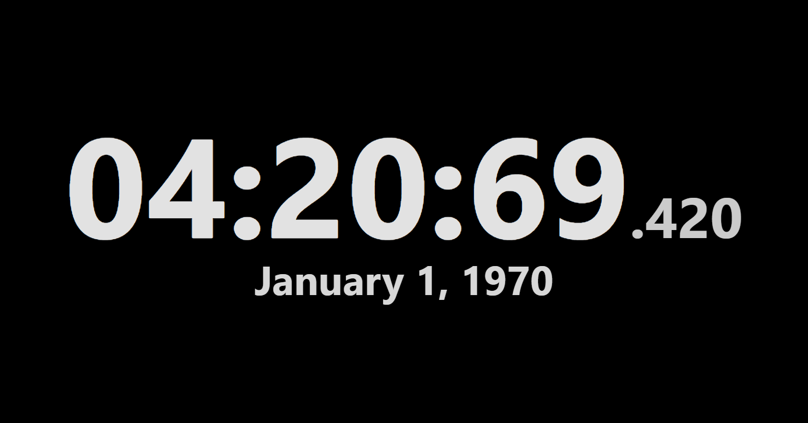

# A Simple Digital Clock App
It's literally just a digital clock, in your browser.

### Demo (fictional)

## Controls

### Toggle Date
Turn the date on and off by `Right-Clicking` anywhere on the screen.
You can also do the same thing by pressing `Space`.

If you are on a touch device, you can toggle the date by `Long-Pressing` anywhere on the screen.

### Brightness
You can adjust the brightness of the clock by `Scrolling` up and down anywhere on the screen.
You can also do the same thing by pressing `Up` and `Down` on your keyboard.

If you are on a touch device, you can adjust the brightness by `Swiping` up and down anywhere on the screen. It has a bit of acceleration, kind of...

Swipe really quickly and release to go up or down a single step. Swipe slowly for the acceleration to kick in and adjust the brightness more quickly. The counter-intuitive sense was intentional, I swear. It will make a lot more sense once you try it.

### Toggle Fullscreen
Toggle fullscreen by `Double-Clicking` anywhere on the screen.
You can also do the same thing by pressing `F`.

If you are on a touch device, you can toggle fullscreen by `Double-Tapping` anywhere on the screen.

## Progressive Web App (PWA)
You can install this website as an app on your phone or computer. Though at the end of the day, it's just a website. Your browser will prompt you to install it when you visit the website. Otherwise, go to your browser's settings and look for the option to install the website as an app.

A quick note for this is that sometimes, offline support does not work.

---

# Desktop Native Implementation

I have also made a desktop native implementation of this app using [Rust](https://www.rust-lang.org/) and [Tauri](https://tauri.app/). As an excuse to learn Tauri, I chose to make a desktop native implementation of this app. It should be prettier, more performant, and more efficient than the web or PWA versions. It also has offline support.

You can visit the implementation's README in this repository at [/desktop-native](/desktop-native). The Windows binary is also available in the releases section.